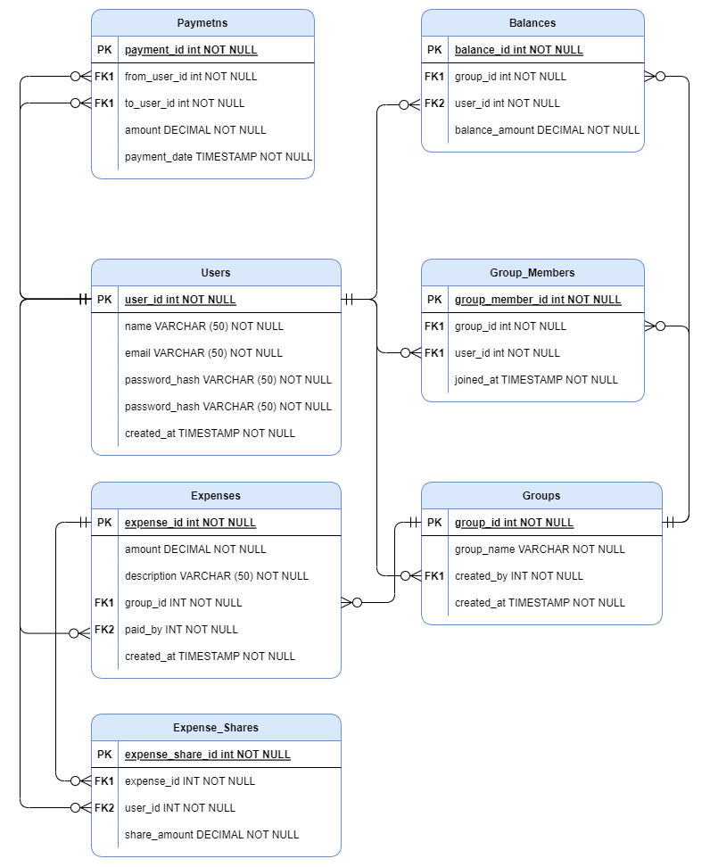

# SplitUP

* [General info](#general-info)
* [Database Design](#database-design)
* [Technologies](#technologies)
* [Set-up](#set-up)

---

## General Info:
SplitUP is a convenient group expense management app that helps you easily split expenses between friends, family, or colleagues. Whether you're traveling, splitting dinner bills, or paying for shared housing, SplitUP automatically calculates who owes whom and how much, eliminating confusion. The application supports different ways of dividing costs (even, uneven, by percentages), and also synchronizes data between all participants in real time. Receive reports, track payments and simplify financial settlements with SplitUp!

---

## Database Design:

### 1. Requirements:

* Creating groups for shared expenses.
* Adding members to a group.
* Adding and categorizing expenses.
* Distribution of costs between participants.
* Viewing the history of expenses and debts.

### 2. Definition of main entities (tables):

* Users: To store information about users (name, email, password, etc.).
* Groups: To store information about groups (group name, creation date, etc.).
* Members of groups (Group_Members): Table for connecting users with groups (user, group, role).
* Expenses: To store each expense (amount, date, description, category, etc.).
* Expense Participants (Expense_Shares): Table for sharing expenses between participants (user, expense, share).
* Payments: A table for fixing payments between users.
* Balances: A table for storing the current balance between participants.

### 3. ERD (Entity-Relationship Diagram) development:

### 4. Definition of relationships between tables

* One-to-Many: A single user can belong to many groups, but each group has many members.
* Many-to-Many: One expense can belong to many users, and one user can be a member of many expenses.

### 5. Optimization and indexing

* Add indexes on frequently used columns such as user_id, group_id, and expense_id to speed up queries.
* Consider using caching to speed up cost or group view operations.

### 6. Ensuring data security

* Encryption of passwords and sensitive information.
* Setting up a role-based access model to limit users' rights based on their roles in groups.
* Use transactions to ensure data integrity when adding and allocating costs.

### 7. Scaling

* If the application will be used by a large number of users, consider scaling the database (vertical and horizontal scaling).
* Use table partitioning or data replication to improve performance.

---

## Technologies
* Java 21
* Spring Boot
* Spring Security
* Spring Data
* Spring Scheduler
* Liquibase
* JUnit 5
* AssertJ
* Mockito
* Lombok
* MySQL
* Docker
* Git
* CI/CD

---

## Set-up